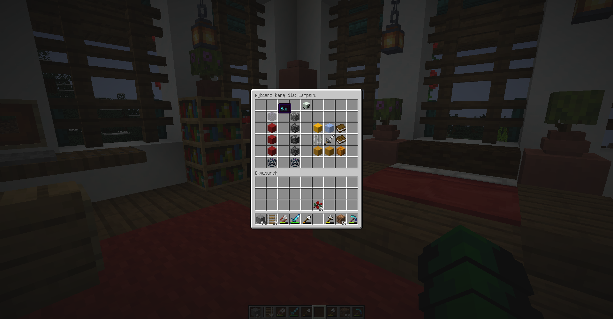
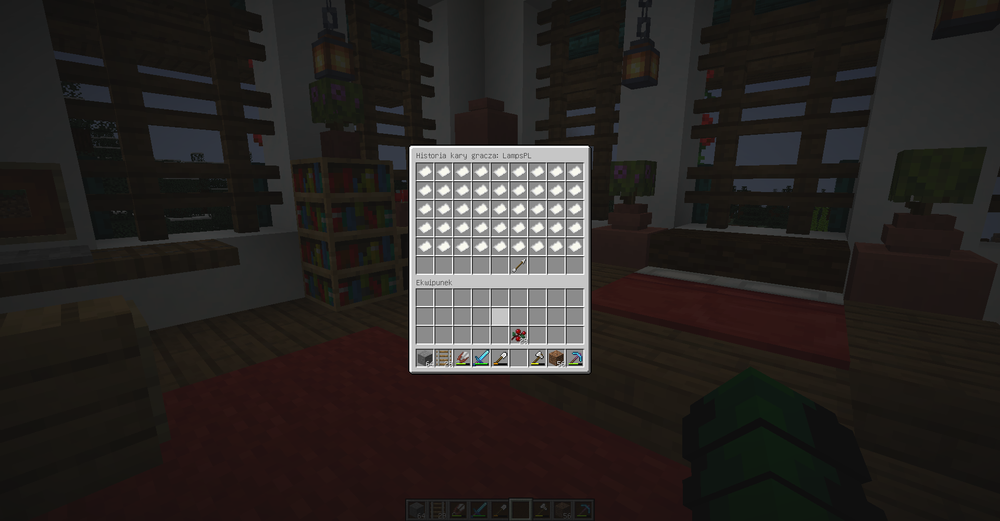

## BanSystem - Minecraft Plugin

**Description:**

BanSystem is a Minecraft plugin that adds a variety of punishment options for players. It utilizes an intuitive block-based GUI for easy application of punishments.

**Technologies used:**

* Java
* CraftBukkit

**Features:**

<ul>
  <li>**Ban:** Permanently bans a player from the server.</li>
  <li>**TempBan:** Temporarily bans a player for a specified duration.</li>
  <li>**Mute:** Silences a player in the chat for a specified duration.</li>
  <li>**Kick:** Kicks a player from the server.</li>
  <li>**Kill:** Kills a player on the server.</li>
  <li>**Ice:** Freezes a player in place, preventing them from moving or using transportation.</li>
  <li>**Warn:** Issues a warning to a player. After receiving 3 warnings, the player will be banned.</li>
  <li>**Snowman:** Spawns a snowman near the player that attacks them. This is used to annoy and disrupt the player.</li>
  <li>**Jail:** Allows you to set a location where a player can be imprisoned.</li>
  <li>**Punishment history:** Provides the ability to view a player's ban history.</li>
  <li>**Report view:** Allows you to view reports submitted against players.</li>
</ul>

**GUI:**

**View History:**

